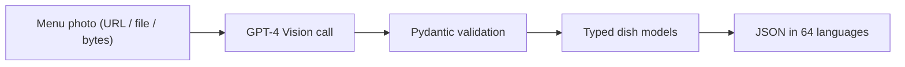

# Menu Analyzer SDK

**Python SDK: one restaurant menu photo in, validated JSON out, with ingredients, allergens, dietary flags and nutrition estimates for every dish, in up to 64 languages.**

   



## Problem it solves

Menus are images, but apps need structured data on allergens, diets and translations. This SDK turns a single photo into typed Pydantic models with one vision call.

> **One image in → structured menu data in 64 languages out.**

Send a restaurant menu photo to GPT-4 Vision and receive a rich, validated JSON with every dish's ingredients, dietary flags, allergens, nutrition estimates, spice level, prep time, and wine pairings — simultaneously translated into **64 languages** in a single API call.

---

## Features

- **Universal image input** — URL, base64, file path, or raw bytes
- **64 languages at once** — one GPT-4 Vision call, zero per-language overhead
- **Structured dish data** — ingredients, dietary flags, allergens, nutrition, spice level, wine pairings
- Yes **Pydantic v2 validation** — fully typed, IDE-friendly output
- **Sync & async** — `analyze_sync()` for scripts, `await analyze()` for async apps
- **~$0.05–0.15 per scan** using your own OpenAI API key

---

## Quick Start

```bash
pip install menu-analyzer
export OPENAI_API_KEY=sk-...
```

```python
from menu_analyzer import MenuAnalyzer

analyzer = MenuAnalyzer()
result = analyzer.analyze_sync("https://example.com/menu.jpg")

print(result.dishes[0].en.dish_name)   # "Grilled Salmon"
print(result.dishes[0].it.dish_name)   # "Salmone alla griglia"
print(result.dishes[0].ja.dish_name)   # "グリルサーモン"
print(result.dishes[0].ar.dish_name)   # "سمك السلمون المشوي"
```

---

## Installation

```bash
# From PyPI
pip install menu-analyzer

# Development install from source
git clone https://github.com/jryahia/menu-analyzer-sdk
cd menu-analyzer-sdk
pip install -e ".[dev]"
```

### Environment setup

```bash
cp .env.example .env
# Edit .env and add your OPENAI_API_KEY
```

---

## Full Example

```python
from menu_analyzer import MenuAnalyzer

analyzer = MenuAnalyzer(api_key="sk-...", model="gpt-4o")

# Accepts: URL, base64, file path, or raw bytes
result = analyzer.analyze_sync("https://restaurant.com/menu.jpg")

print(f"Dishes found: {result.total_dishes_detected}")
print(f"Processing time: {result.processing_time_ms} ms")

for dish in result.dishes:
    en = dish.en
    print(f"\n {en.dish_name}")
    print(f"   Ingredients:  {', '.join(en.ingredients)}")
    print(f"   Dietary:      {', '.join(en.dietary_flags)}")
    print(f"   Allergens:    {', '.join(en.allergen_warnings)}")
    print(f"   Spice:        {'' * en.spice_level or 'mild'}")
    print(f"   Prep time:    {en.estimated_prep_minutes} min")
    if en.nutrition:
        n = en.nutrition
        print(f"   Nutrition:    {n.calories} kcal | {n.protein_g}g protein")
    if en.wine_pairing:
        print(f"   Wine pairing: {', '.join(en.wine_pairing)}")

    # Access any locale
    print(f"    {dish.fr.dish_name}")
    print(f"    {dish.ja.dish_name}")
    print(f"    {dish.ar.dish_name}")
    print(f"    {dish.zh_CN.dish_name}")
```

### Sample output

```json
{
  "dishes": [
    {
      "en": {
        "dish_name": "Truffle Risotto",
        "ingredients": ["Arborio rice", "black truffle", "Parmesan", "white wine", "shallots", "butter"],
        "dietary_flags": ["vegetarian", "gluten_free"],
        "allergen_warnings": ["lactose"],
        "nutrition": { "calories": 520, "protein_g": 12.0, "carbs_g": 68.0, "fat_g": 22.0 },
        "spice_level": 0,
        "estimated_prep_minutes": 25,
        "wine_pairing": ["Barolo", "Barbaresco"]
      },
      "it": {
        "dish_name": "Risotto al Tartufo",
        "ingredients": ["Riso Arborio", "tartufo nero", "Parmigiano", "vino bianco", "scalogno", "burro"],
        ...
      },
      "zh-CN": {
        "dish_name": "松露意大利烩饭",
        ...
      }
    }
  ],
  "raw_text": "ANTIPASTI\nTruffle Risotto €18...",
  "total_dishes_detected": 12,
  "processing_time_ms": 8432
}
```

### Async usage

```python
import asyncio
from menu_analyzer import MenuAnalyzer

async def main():
    analyzer = MenuAnalyzer()
    result = await analyzer.analyze("https://restaurant.com/menu.jpg")
    print(result.dishes[0].en.dish_name)

asyncio.run(main())
```

### From a file path

```python
result = analyzer.analyze_sync("/photos/menu_scan.jpg")
```

### From raw bytes

```python
with open("menu.png", "rb") as f:
    result = analyzer.analyze_sync(f.read())
```

---

## Data Models

```
MenuAnalysisResult
├── dishes: list[MultiLangOutput]     # one per dish
├── raw_text: str | None              # full OCR text
├── total_dishes_detected: int
└── processing_time_ms: int

MultiLangOutput
└── <locale_code>: DishAnalysis       # 64 keys: en, it, fr, ...

DishAnalysis
├── dish_name: str
├── ingredients: list[str]
├── dietary_flags: list[str]          # vegan, vegetarian, gluten_free, keto, halal, kosher
├── allergen_warnings: list[str]      # lactose, nuts, shellfish, eggs, soy, gluten
├── nutrition: DishNutrition | None
│   ├── calories: int | None
│   ├── protein_g: float | None
│   ├── carbs_g: float | None
│   └── fat_g: float | None
├── spice_level: int                  # 0–5
├── estimated_prep_minutes: int | None
└── wine_pairing: list[str]
```

---

## Supported Locales (64)

| Code | Language | Native | Flag |
|------|----------|--------|------|
| en | English | English |  |
| it | Italian | Italiano |  |
| fr | French | Français |  |
| es | Spanish | Español |  |
| de | German | Deutsch |  |
| pt | Portuguese | Português |  |
| nl | Dutch | Nederlands |  |
| sv | Swedish | Svenska |  |
| no | Norwegian | Norsk |  |
| da | Danish | Dansk |  |
| fi | Finnish | Suomi |  |
| pl | Polish | Polski |  |
| cs | Czech | Čeština |  |
| ro | Romanian | Română |  |
| hu | Hungarian | Magyar |  |
| el | Greek | Ελληνικά |  |
| ru | Russian | Русский |  |
| he | Hebrew | עברית |  |
| ar | Arabic | العربية |  |
| tr | Turkish | Türkçe |  |
| fa | Persian | فارسی |  |
| ku | Kurdish | Kurdî |  |
| ps | Pashto | پښتو |  |
| tg | Tajik | Тоҷикӣ |  |
| zh-CN | Chinese (Simplified) | 中文（简体） |  |
| zh-TW | Chinese (Traditional) | 中文（繁體） |  |
| ja | Japanese | 日本語 |  |
| ko | Korean | 한국어 |  |
| hi | Hindi | हिन्दी |  |
| ur | Urdu | اردو |  |
| bn | Bengali | বাংলা |  |
| ta | Tamil | தமிழ் |  |
| te | Telugu | తెలుగు |  |
| mr | Marathi | मराठी |  |
| gu | Gujarati | ગુજરાતી |  |
| kn | Kannada | ಕನ್ನಡ |  |
| ml | Malayalam | മലയാളം |  |
| pa | Punjabi | ਪੰਜਾਬੀ |  |
| ne | Nepali | नेपाली |  |
| si | Sinhala | සිංහල |  |
| th | Thai | ภาษาไทย |  |
| vi | Vietnamese | Tiếng Việt |  |
| id | Indonesian | Bahasa Indonesia |  |
| ms | Malay | Bahasa Melayu |  |
| tl | Filipino | Filipino |  |
| my | Burmese | မြန်မာဘာသာ |  |
| km | Khmer | ភាសាខ្មែរ |  |
| lo | Lao | ພາສາລາວ |  |
| sw | Swahili | Kiswahili |  |
| am | Amharic | አማርኛ |  |
| om | Oromo | Afaan Oromoo |  |
| ha | Hausa | Hausa |  |
| yo | Yoruba | Yorùbá |  |
| ig | Igbo | Igbo |  |
| zu | Zulu | isiZulu |  |
| af | Afrikaans | Afrikaans |  |
| st | Sesotho | Sesotho |  |
| tn | Setswana | Setswana |  |
| ts | Tsonga | Xitsonga |  |
| ve | Venda | Tshivenḓa |  |
| xh | Xhosa | isiXhosa |  |
| nso | Northern Sotho | Sesotho sa Leboa |  |
| ss | Swati | siSwati |  |
| ber | Berber (Tamazight) | ⵜⴰⵎⴰⵣⵉⵖⵜ |  |

---

## Use Cases

### QR Code Menus
Replace static PDFs with a live, multilingual digital menu. Scan once, serve in any language.

```python
result = analyzer.analyze_sync("menu_photo.jpg")
# Store result.model_dump() in your DB — instant multilingual menu
```

### Food Delivery Apps
Automatically localize menus from partner restaurants without manual translation work.

### POS Systems
Ingest paper menus during onboarding and generate structured item data for your POS catalog.

### Google Maps / Review Platforms
Enrich location data with structured dish info, dietary filters, and allergen warnings.

### iOS / Android Integration

```swift
// iOS — POST base64 image to your backend, return JSON
let result = try await menuService.analyze(imageData: menuPhoto.jpegData)
let dishInCurrentLocale = result.dishes[0][currentLanguageCode]
```

### Hotel / Hospitality
Provide guests with menus in their native language automatically based on passport locale.

---

## Pricing

This SDK uses your own OpenAI API key — **no subscription required**.

| Menu size | Estimated cost |
|-----------|---------------|
| Simple menu (5–10 dishes) | ~$0.05 |
| Mid-size menu (10–25 dishes) | ~$0.08–0.12 |
| Large menu (25–50 dishes) | ~$0.12–0.20 |

Costs are based on GPT-4o image + token pricing. The 64-language output drives token usage (~10k–16k tokens per response), which is the dominant cost.

---

## Configuration

```python
# Custom model (any OpenAI vision model)
analyzer = MenuAnalyzer(model="gpt-4o-mini")  # cheaper, less accurate

# List all supported locales
for locale in analyzer.supported_locales():
    print(locale["code"], locale["flag_emoji"], locale["name"])
```

---

## Integration Guide

### For Restaurants

1. Take a clear, well-lit photo of your entire menu
2. Run `analyze_sync()` once during setup
3. Store the JSON response in your database
4. Serve `result.dishes[i].<locale_code>` based on the visitor's browser language

### For iOS/Android Developers

Send the image as base64 from the client to your backend endpoint:

```python
# Backend endpoint (FastAPI example)
@app.post("/analyze-menu")
async def analyze_menu(image_b64: str):
    analyzer = MenuAnalyzer()
    result = await analyzer.analyze(image_b64)
    return result.model_dump(by_alias=True)
```

### For POS Vendors

During restaurant onboarding, have staff photograph their existing paper menu:

```python
result = analyzer.analyze_sync(menu_photo_path)
pos_items = [
    {
        "name": dish.en.dish_name,
        "allergens": dish.en.allergen_warnings,
        "calories": dish.en.nutrition.calories if dish.en.nutrition else None,
    }
    for dish in result.dishes
]
```

---

## Development

```bash
pip install -e ".[dev]"
ruff check .
mypy menu_analyzer/
pytest tests/
```

---

## License

MIT — free for commercial use.
